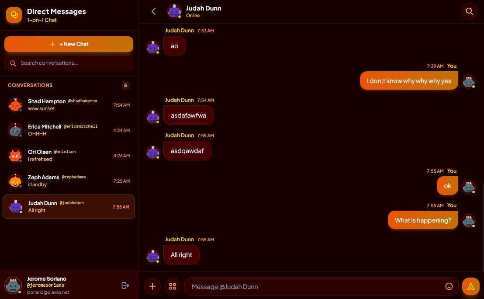
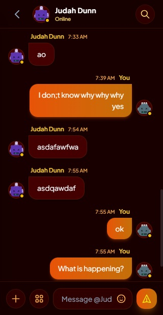

# Laravel-Livewire-OneOnOneChat

- This is a real-time 1-on-1 chat Laravel application built with Livewire 4, Laravel Reverb WebSockets, and Tailwind CSS styled in a Sunset Glow dark theme.

- [**Laravel**](https://laravel.com/) is a web application framework with expressive, elegant syntax.

- [**Livewire**](https://livewire.laravel.com/) is the most productive way to build your next web app.

- [**Laravel Reverb**](https://laravel.com/docs/reverb) is a blazingly fast, scalable real-time WebSocket server built for Laravel.

- [**Tailwind CSS**](https://tailwindcss.com/) is a utility-first CSS framework for rapidly building custom user interfaces.

## How to setup and run

1. Install dependencies.
```
composer install
npm install
```

2. Generate application key and seed database.
```
php artisan key:generate
php artisan migrate:fresh --seed
```

3. Compile frontend assets.
```
npm run build
```

4. Start the Laravel Reverb WebSocket server.
```
php artisan reverb:start
```

5. Serve the app on your local IP to access it over the network.
```
php artisan serve --host=<ip>
```

## Screenshots

### This is the main page desktop view.


### This is the main page mobile view.



## Developer

- [Jerome Soriano](https://github.com/dvxgit-jsoriano)

*"Feel free to read, use, and apply to your projects."*
